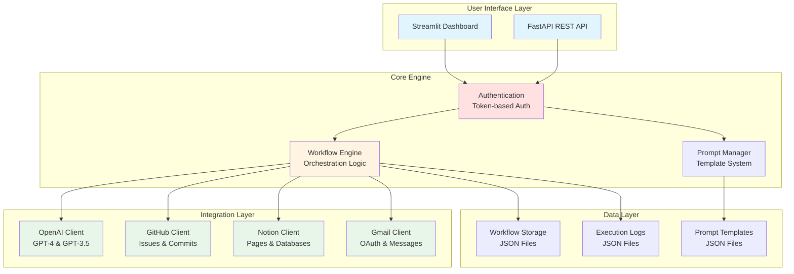
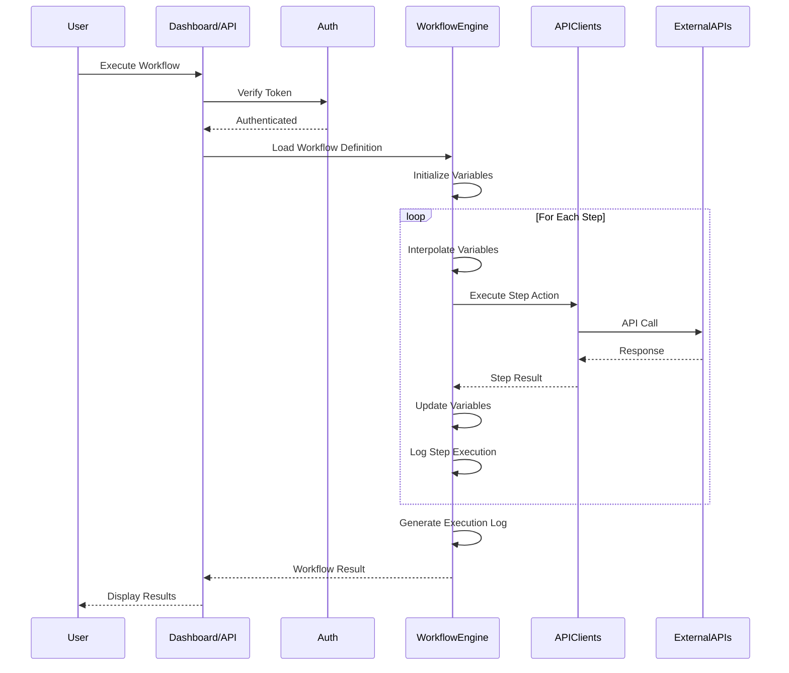
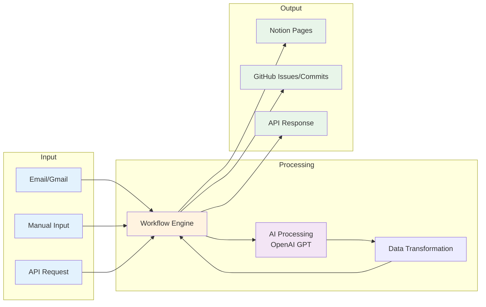
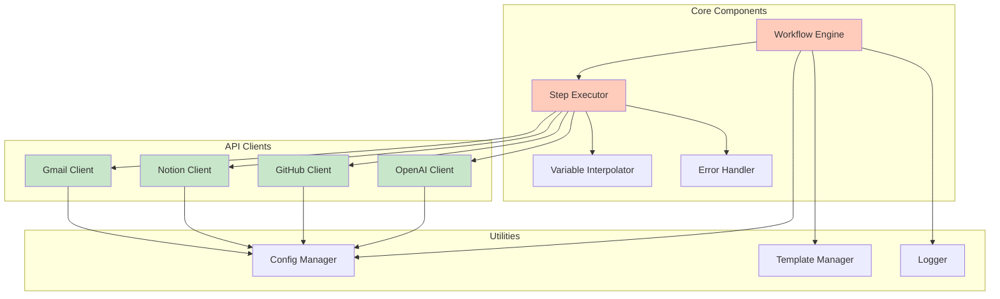
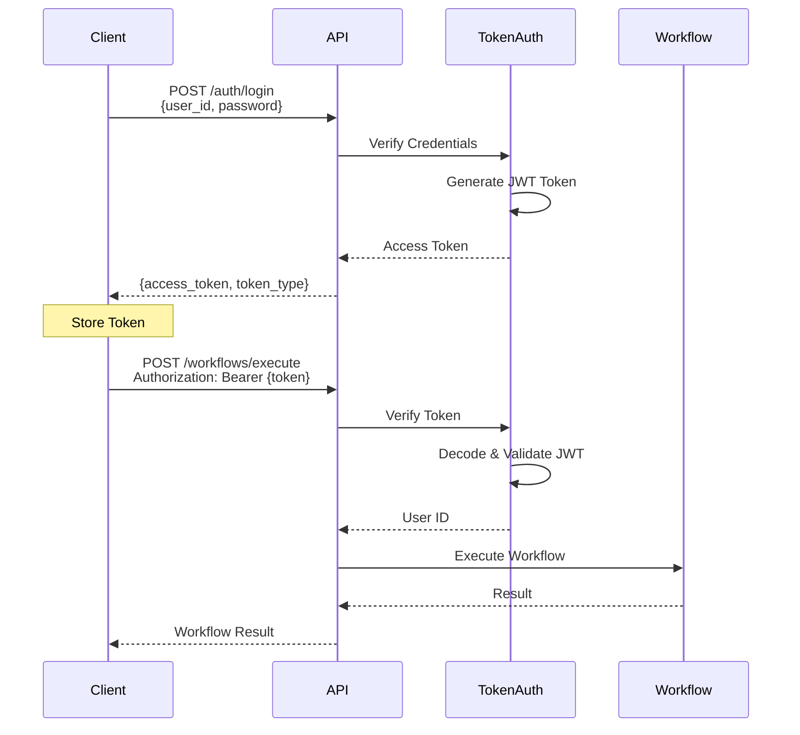

# AI-Orchestra Architecture

## System Architecture

## Workflow Execution Flow

## Data Flow Architecture

## Component Interaction

## Authentication Flow

## Modular Architecture Benefits

### 1. **Separation of Concerns**
- Each module has a single, well-defined responsibility
- Easy to understand, test, and maintain
- Changes in one module don't affect others

### 2. **Extensibility**
- Add new API integrations by implementing client interface
- Add new workflow steps without modifying core engine
- Easy to add new authentication methods

### 3. **Testability**
- Each component can be tested independently
- Mock external dependencies easily
- Unit tests for core logic, integration tests for workflows

### 4. **Reusability**
- API clients can be used in other projects
- Workflow engine is generic and adaptable
- Template system can be applied to any use case

### 5. **Scalability**
- Async execution support ready to implement
- Can distribute workflow execution across workers
- Modular design supports microservices architecture

## Technology Stack Details

### Backend Framework
- **FastAPI**: Modern, fast web framework with automatic API documentation
- **Pydantic**: Data validation and settings management
- **Uvicorn**: ASGI server for production deployment

### Frontend
- **Streamlit**: Rapid dashboard development with Python
- Interactive UI without JavaScript complexity

### AI/ML Integration
- **OpenAI SDK**: GPT-4 and GPT-3.5-turbo for text generation
- Supports function calling and structured outputs

### API Integrations
- **PyGithub**: Complete GitHub API wrapper
- **Notion SDK**: Official Notion API client
- **Google API Client**: Gmail API integration with OAuth 2.0

### Data & Storage
- **JSON**: Lightweight workflow and template storage
- **YAML**: Human-readable configuration files
- File-based for simplicity, easily migrated to database

### Security
- **JWT Tokens**: Stateless authentication
- **OAuth 2.0**: Secure third-party authorization (Gmail)
- **Environment Variables**: Sensitive data management
